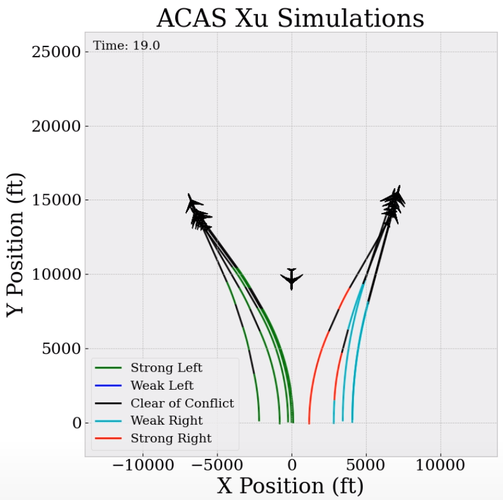

# ACAS Xu Visualization

[]

This animation shows closed-loop simulations of the ACAS-Xu systex [1], using the onnx runtime and assuming the vertical seperation of the aircraft is 0.

The main code it run is make_animation.py. You an edit the code directly if you want to switch between creating an mp4 file and plotting to the screen.

[1] Katz, Guy, et al. "Reluplex: An efficient SMT solver for verifying deep neural networks." International Conference on Computer Aided Verification. Springer, Cham, 2017.
